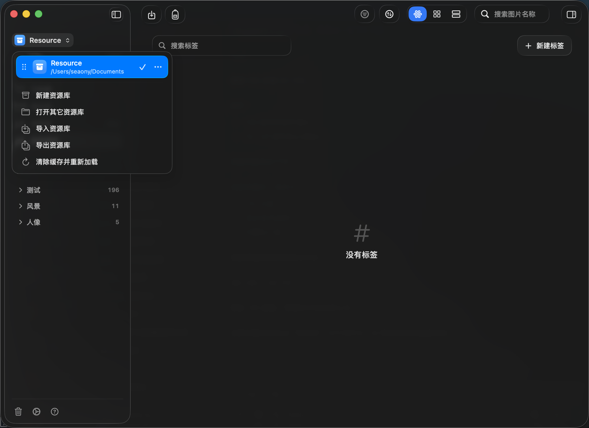
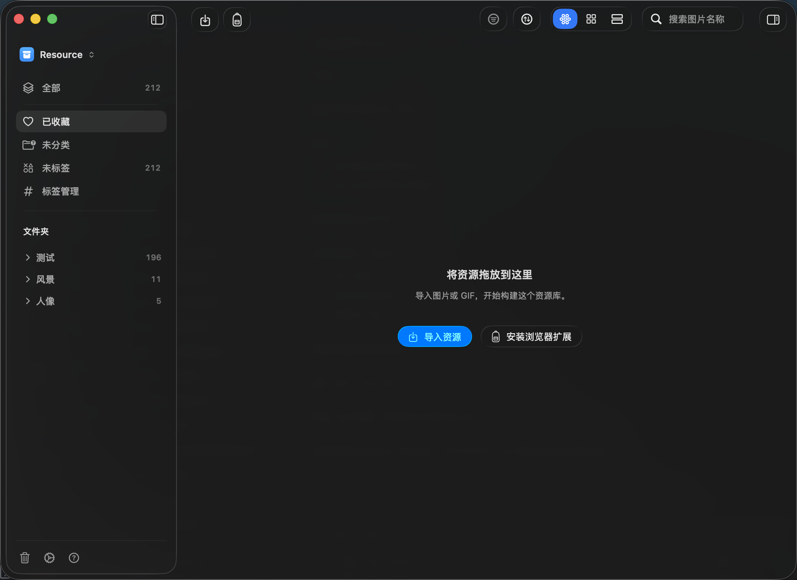
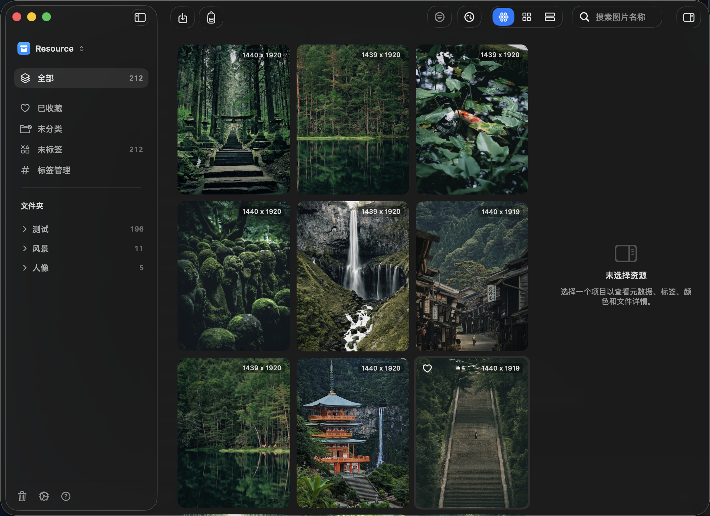
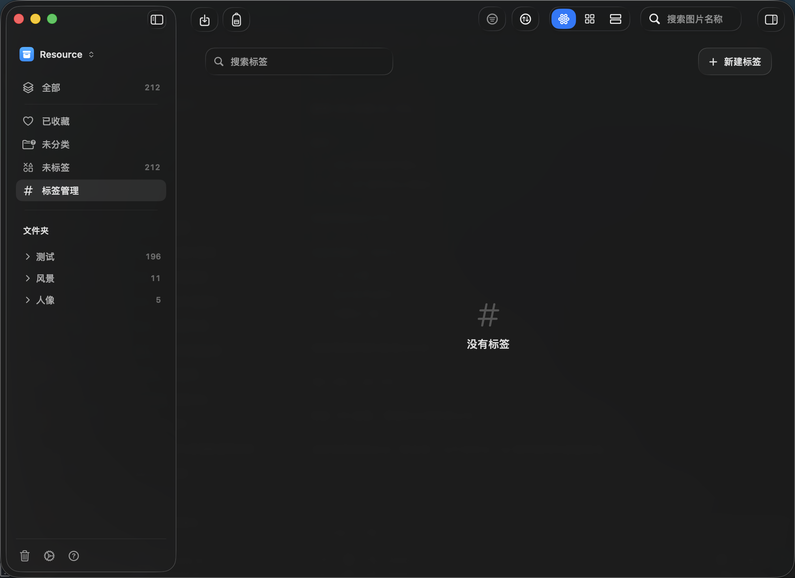
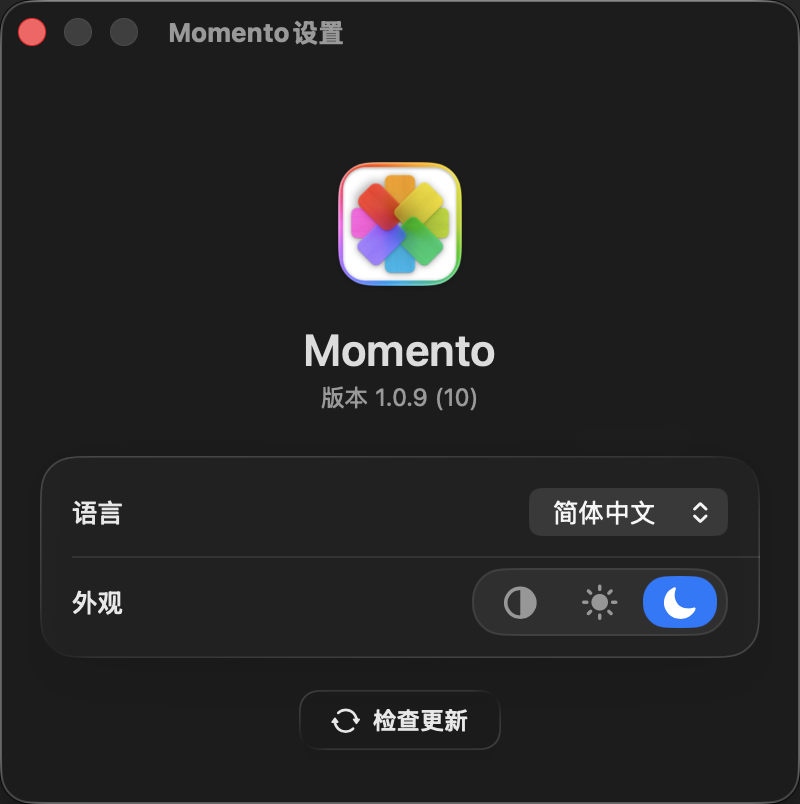

# Momento 产品说明

本文档记录当前版本已经可用的主要功能、页面和操作路径，供普通用户了解 Momento 怎么用，也作为后续功能更新时持续追加的基础。

## 当前记录基线

- 版本：Momento 1.0.9 (10)
- Commit：65e7c0a
- 记录日期：2026-06-08
- 运行环境：真实 macOS App，使用当前源码构建出的 `Momento.app`
- 截图样例库：`Resource`，包含 212 个资源、3 个文件夹

> Momento 是原生 macOS 应用，不是 Web 页面。本轮截图使用 macOS 窗口截图和可访问性检查完成，CDP 不适用于这个项目。

## 快速开始

首次打开 Momento 时，如果没有已打开的资源库，会看到欢迎页。点击“新建资源库”可以创建一个新的 `.momento` 资源库；点击“打开资源库”可以选择已有的 `.momento` 或旧版 `.momentolibrary` 文件。

打开资源库后，主窗口分为三块：左侧是资源库和分类导航，中间是资源列表，右侧检查器可查看选中资源的详情。

## 资源库菜单

点击左上角资源库名称（例如 `Resource`）会打开资源库菜单。

- 当前资源库行：显示资源库名称和所在位置；点击其他资源库行会切换资源库。
- “新建资源库”：输入资源库名称，再选择保存位置，Momento 会创建一个新的资源库包。
- “打开其它资源库”：打开文件选择器，选择已有资源库后进入该资源库。
- “导入资源库”：把已有资源库复制进 Momento 管理，并切换到导入后的资源库。
- “导出资源库”：把当前资源库另存为一个 `.momento` 包，便于备份或迁移。
- “清除缓存并重新加载”：重新生成临时缓存并刷新当前资源库，适合缩略图或缓存状态异常时使用。
- 行尾“更多”按钮：可编辑资源库名称、在 Finder 中显示资源库，或删除该资源库。

## 主资源页面

主资源页面用于浏览、筛选、搜索和整理图片资源。

- 左侧“全部”：显示当前资源库中的全部资源。
- “已收藏”：只显示被收藏的资源。
- “未分类”：显示没有加入任何文件夹的资源。
- “未标签”：显示没有标签的资源。
- “标签管理”：进入标签列表页面。
- “文件夹”：显示用户创建的文件夹；点击文件夹只看该文件夹里的资源，点击折叠箭头展开或收起子文件夹。
- 中间资源网格：以瀑布流、网格或列表展示资源。双击资源会打开预览；右键资源可预览原图、导出、刷新缩略图、重新分析颜色、在 Finder 中显示或移入废纸篓。
- 资源上的爱心按钮：点击后加入或移出收藏。
- 顶部搜索框：输入图片名称进行搜索；有搜索内容时会显示结果数量，并可点击清除按钮恢复列表。

## 空状态与导入

当当前分类没有资源时，中间区域会显示空状态。

- “导入资源”：打开文件选择器，可选择图片、GIF 或文件夹导入当前资源库。
- 拖放资源：把图片或文件夹直接拖到窗口中，也会开始导入。
- “安装浏览器扩展”：打开浏览器扩展发布页，用于从浏览器保存图片到 Momento。
- 导入过程中会出现进度面板，显示扫描、已处理数量、已导入数量、已跳过数量和当前文件名。

## 筛选

点击顶部漏斗按钮会打开筛选浮层。筛选会作用在当前左侧分类或文件夹范围内。

- “颜色”：按图片主色筛选。点击色块会选中该颜色，再次点击取消。
- “标签”：按标签筛选。标签较多时会出现搜索框。
- “文件类型”：按文件扩展名筛选，例如 JPG、PNG、WEBP。
- 筛选按钮高亮时，表示当前列表正在被筛选。

## 排序

点击顶部排序按钮会打开排序浮层。

- “添加时间”：按导入时间排序。
- “文件名称”：按资源名称排序。
- “文件大小”：按资源文件大小排序。
- 当前选中的排序项右侧会显示方向图标；再次选择同一项会切换升序或降序。

## 视图切换

顶部三个视图按钮用于切换资源列表的显示方式。

- 瀑布流：适合浏览不同尺寸的图片，当前默认视图。
- 网格：用更规整的格子浏览图片。
- 列表：以更紧凑的列表方式查看资源。

这些视图只改变浏览方式，不改变资源本身。

## 检查器

点击窗口右上角的检查器按钮，或使用“视图”菜单中的“切换检查器”，可以显示或隐藏右侧检查器。

- 未选择资源时，检查器显示“未选择资源”。
- 选择一个资源后，检查器会显示预览图、颜色、标题、类型、尺寸、大小、添加时间、来源链接和 EXIF 信息。
- 点击标题可以重命名资源标题。
- 点击颜色色块会复制对应色值，并显示复制成功提示。
- 在“标签”区域点击加号，可以搜索已有标签，或输入新名称创建并添加标签。
- 在“文件夹”区域点击加号，可以把资源加入一个或多个文件夹。
- 多选资源时，检查器会显示“已选择 N 个资源”，并支持批量添加或移除标签、文件夹。

本轮运行中，资产网格没有暴露稳定的可访问性选择入口，因此只截取到检查器空态；上述选中后的行为来自当前版本已实现的检查器界面和操作入口。

## 标签管理

点击左侧“标签管理”进入标签管理页。

- 搜索框：按名称查找已有标签。
- “新建标签”：新增一个标签。
- 标签列表：显示标签名称和关联资源数量。
- 每个标签右侧的“更多”按钮：可编辑标签名称或删除标签。
- 删除标签时会出现确认对话框，避免误删。

当前样例库没有标签，所以页面显示“没有标签”。

## 文件夹

左侧“文件夹”区域用于按主题或项目整理资源。

- 点击文件夹名称：只显示该文件夹中的资源。
- 点击文件夹左侧箭头：展开或折叠子文件夹。
- 文件夹标题行悬停时会出现“新建文件夹”按钮。
- 右键文件夹：可新建子文件夹、编辑文件夹名称或删除文件夹。
- 拖动文件夹：可调整文件夹顺序或层级。
- 把资源拖到文件夹上：会把这些资源加入该文件夹。

## 废纸篓

点击左下角废纸篓按钮进入废纸篓。

- 普通分类中删除资源时，资源会先移入废纸篓。
- 在废纸篓中，右键资源可以恢复，或永久删除。
- 永久删除会出现确认对话框；确认后资源从资源库中移除，不能再从 Momento 内恢复。

## 设置

点击左下角齿轮按钮打开设置窗口。

- “语言”：选择系统语言、English 或简体中文。
- “外观”：选择跟随系统、浅色或深色。
- “检查更新”：手动检查是否有新版本；有可用版本时会显示更新入口。

## 菜单与快捷操作

Momento 也提供 macOS 菜单入口。

- “资源库 > 导入资源”：选择图片或文件夹导入当前资源库。
- “资源库 > 导入资源库”：导入另一个资源库包。
- “资源库 > 导出资源库”：导出当前资源库包。
- “视图 > 瀑布流 / 网格 / 列表”：切换资源展示方式。
- “视图 > 聚焦搜索”：把光标移动到搜索框。
- “视图 > 切换筛选 / 切换排序 / 切换检查器”：打开或关闭对应面板。
- “资源 > 快速预览”：预览当前选中资源。
- “资源 > 移到废纸篓”：把当前选中资源移入废纸篓。

常用快捷键：

- `Command-I`：导入资源。
- `Command-1`：瀑布流视图。
- `Command-2`：网格视图。
- `Command-3`：列表视图。
- `Command-F`：聚焦搜索。
- `Option-Command-F`：切换筛选。
- `Option-Command-S`：切换排序。
- `Option-Command-I`：切换检查器。
- `Space`：快速预览。
- `Command-Delete`：移到废纸篓，或在废纸篓中触发永久删除确认。

## 后续更新记录模板

后续功能更新时，在这里追加新条目，不要重写旧记录。

### YYYY-MM-DD / 版本号 / commit

- 新增页面：
- 新增入口：
- 新增按钮：
- 行为变化：
- 新增截图：
- 未覆盖或需用户确认：

## 本轮截图清单

- `product-guide-assets/01-main-library.png`：主资源页面。
- `product-guide-assets/02-filter-popover.png`：筛选浮层。
- `product-guide-assets/03-sort-popover.png`：排序浮层。
- `product-guide-assets/04-inspector.png`：检查器空态。
- `product-guide-assets/06-tag-management.png`：标签管理页。
- `product-guide-assets/07-settings.png`：设置窗口。
- `product-guide-assets/08-library-menu.png`：资源库菜单。
- `product-guide-assets/09-empty-import-state.png`：空状态与导入入口。
