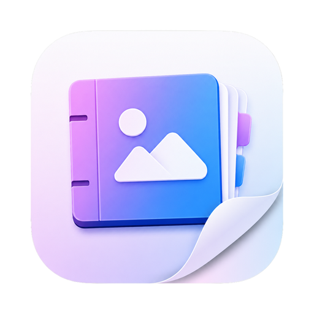
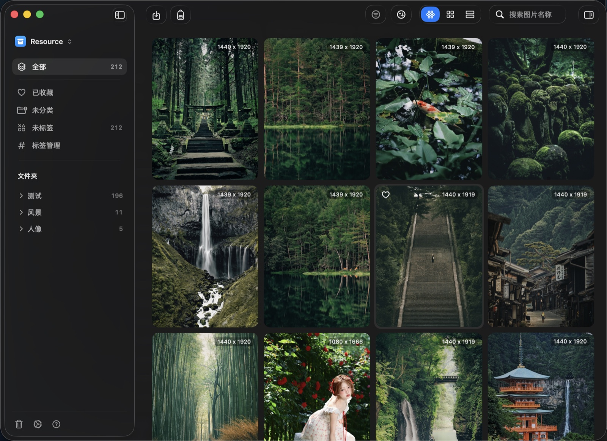
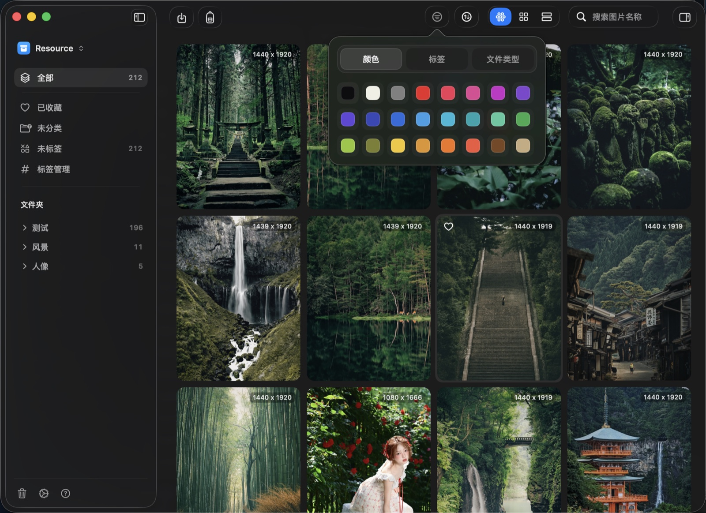
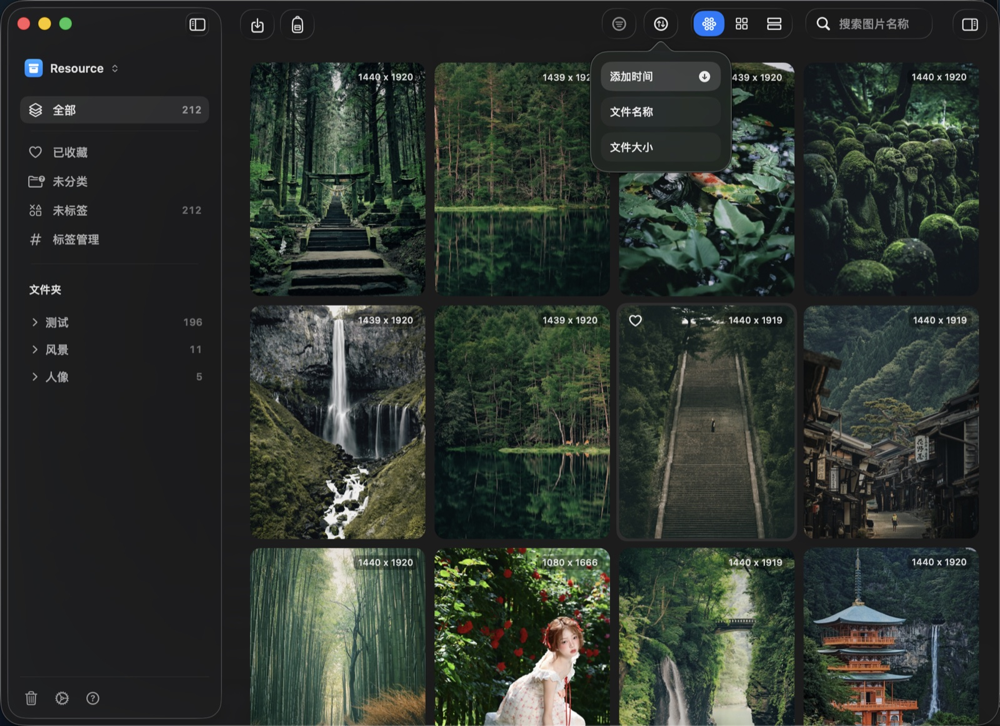
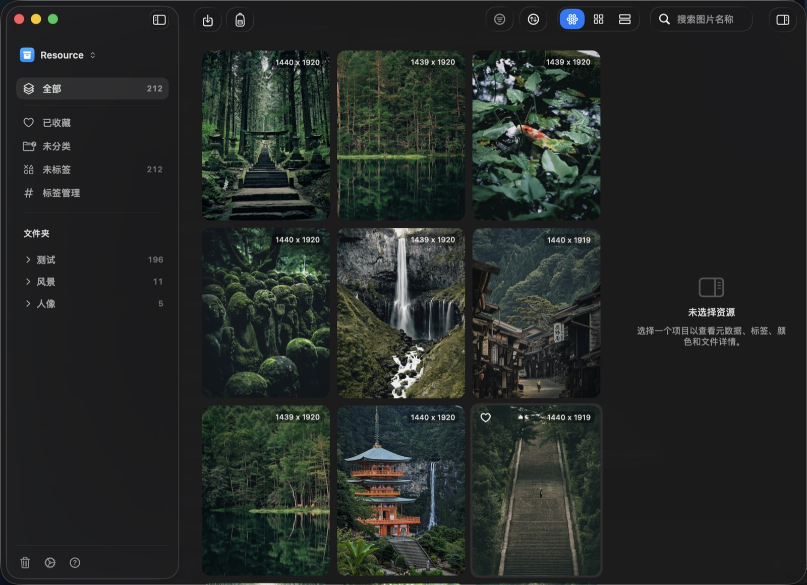
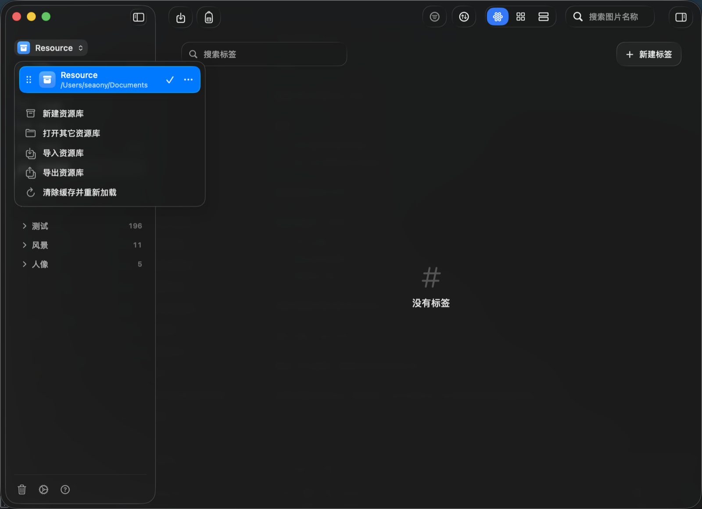
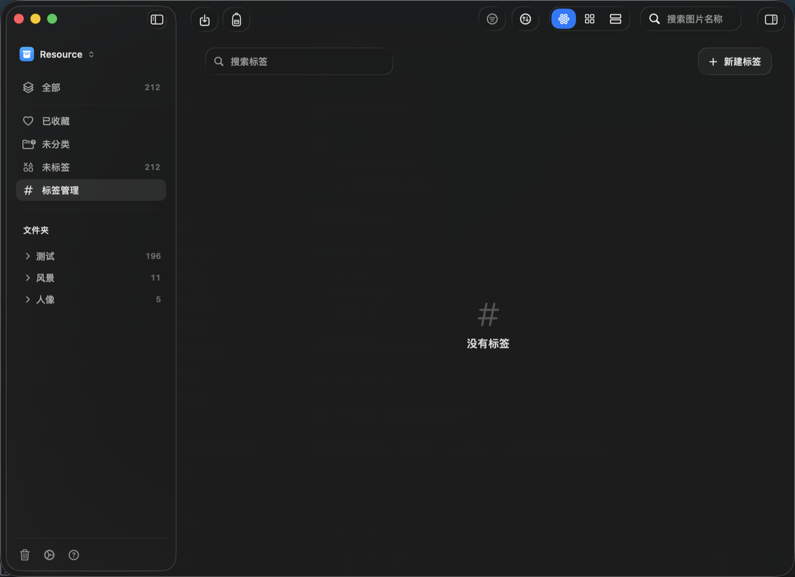
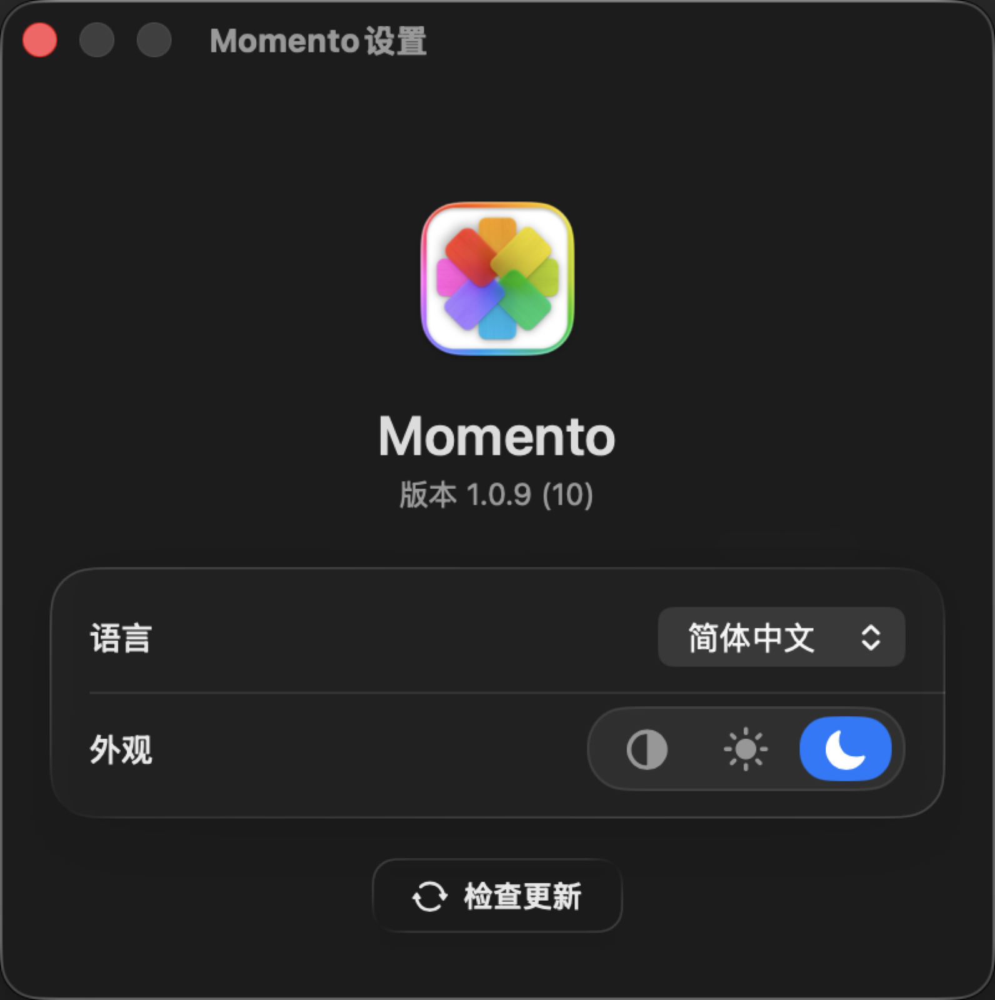

<div align="center">
  <br />
  
  <h1>Momento</h1>
  <p>
    <strong>一个安静、漂亮、原生的 macOS 图片素材库。</strong>
  </p>
  <p>
    把散落在 Finder、浏览器和项目文件夹里的灵感图片，<br />
    收进一个本地、快速、克制的素材库，再用标签、文件夹、颜色重新整理好。
  </p>

  <p>
    
    
    
    
    
  </p>

  <p>
    <a href="https://github.com/Seaony/Momento/releases/latest"><strong>下载最新版</strong></a>
    &nbsp;·&nbsp;
    <a href="#-功能亮点">功能亮点</a>
    &nbsp;·&nbsp;
    <a href="#-界面一览">界面一览</a>
    &nbsp;·&nbsp;
    <a href="#-快捷键">快捷键</a>
    &nbsp;·&nbsp;
    <a href="#-适合谁">适合谁</a>
  </p>
  <br />

  
</div>

<br />

## 为什么是 Momento

图片素材越来越多，但真正要找的时候，它们总是散在下载目录、桌面、聊天记录和项目文件夹里。

Momento 把素材管理做成**本地优先**的原生 macOS App：素材保存在你自己的磁盘上，不需要云端账号；界面尽量克制，操作尽量直接。导入、浏览、筛选、整理、预览、导出，都围绕图片素材的日常工作流展开。

它用 SwiftUI + AppKit 从头写成，资源列表走定制的 `NSCollectionView` 渲染路径，为**十万级素材库**的流畅滚动而设计。

<br />

## ✨ 功能亮点

<table>
  <tr>
    <td width="50%" valign="top">
      <h3>🗂 集中收纳</h3>
      <p>创建独立素材库，把图片、GIF 和整个文件夹批量导入。相同文件按内容哈希自动去重，不会反复占用空间；导入文件夹时保留原始层级。</p>
    </td>
    <td width="50%" valign="top">
      <h3>🖼 三种视图</h3>
      <p>瀑布流适合灵感浏览，网格适合快速扫描，列表适合查看名称、尺寸和信息。不同整理场景随时切换，只改浏览方式，不动素材本身。</p>
    </td>
  </tr>
  <tr>
    <td width="50%" valign="top">
      <h3>🎨 颜色筛选</h3>
      <p>导入时自动分析图片调色板，并归入常用色系。找黑色、蓝色、橙色或绿色氛围图时，一键筛出。</p>
    </td>
    <td width="50%" valign="top">
      <h3>🏷 快速整理</h3>
      <p>用收藏、标签和多层文件夹整理素材。支持拖拽归类、批量打标签，未分类 / 未标签一眼可见。</p>
    </td>
  </tr>
  <tr>
    <td width="50%" valign="top">
      <h3>🔍 详细信息</h3>
      <p>检查器展示预览、色板、标题、尺寸、大小、来源链接和 EXIF。能读到的相机、镜头、曝光数据会自动呈现，点色块即可复制色值。</p>
    </td>
    <td width="50%" valign="top">
      <h3>📤 拖拽导出</h3>
      <p>选中图片直接拖到 Finder 或桌面，文件复制在后台完成、不卡界面；也可通过导出面板选择原文件、JPEG 或 PNG。</p>
    </td>
  </tr>
</table>

<br />

## 🖥 界面一览

<table>
  <tr>
    <td width="50%" align="center">
      <br />
      <sub><b>筛选</b> · 按颜色、标签、文件类型缩小范围</sub>
    </td>
    <td width="50%" align="center">
      <br />
      <sub><b>排序</b> · 按添加时间、名称、大小升降序</sub>
    </td>
  </tr>
  <tr>
    <td width="50%" align="center">
      <br />
      <sub><b>检查器</b> · 色板、信息、EXIF、标签与文件夹</sub>
    </td>
    <td width="50%" align="center">
      <br />
      <sub><b>资源库</b> · 新建、切换、导入导出、清缓存</sub>
    </td>
  </tr>
  <tr>
    <td width="50%" align="center">
      <br />
      <sub><b>标签管理</b> · 新建、重命名、查看关联数量</sub>
    </td>
    <td width="50%" align="center">
      <br />
      <sub><b>设置</b> · 语言、外观、检查更新</sub>
    </td>
  </tr>
</table>

<br />

## ⌨️ 快捷键

| 快捷键 | 操作 | | 快捷键 | 操作 |
| :-- | :-- | :-- | :-- | :-- |
| `⌘ I` | 导入素材 | | `⌘ F` | 聚焦搜索 |
| `⌘ 1` | 瀑布流视图 | | `⌥ ⌘ F` | 切换筛选 |
| `⌘ 2` | 网格视图 | | `⌥ ⌘ S` | 切换排序 |
| `⌘ 3` | 列表视图 | | `⌥ ⌘ I` | 切换检查器 |
| `Space` | 快速预览 | | `⌘ ⌫` | 移到废纸篓 |

<br />

## 👥 适合谁

- **设计师** —— 管理参考图、Moodboard、界面截图、品牌素材。
- **摄影师** —— 快速筛选样片、查看 EXIF、按颜色和标签归类。
- **内容创作者** —— 保存封面参考、素材图、灵感图片和可复用视觉资产。
- **独立开发者** —— 整理 App 截图、产品素材、社媒配图和发布资源。

<br />

## 📦 支持的内容

当前版本聚焦图片素材：

- 支持 macOS 可识别的常见图片格式和 GIF。
- RAW 是否可导入，取决于当前系统的图片解码能力。
- SVG、PDF、视频暂不作为素材导入格式。

素材库是本地 package，扩展名为 `.momento`。原始文件、缩略图和数据库都保存在素材库里：

```text
<Name>.momento/
├── manifest.json
├── database/library.sqlite
├── assets/<hashPrefix>/<sha256>.<ext>
├── thumbnails/<sha256>.png
├── previews/
└── metadata/import-sessions/
```

<br />

## 🔄 自动更新

Momento 集成 Sparkle 2。发布新版本后，App 会通过 GitHub Releases 和 appcast 检查更新、下载更新包并完成安装。

如果你只是使用 App，直接下载最新版 DMG 即可：

<div align="center">
  <br />
  <a href="https://github.com/Seaony/Momento/releases/latest"><strong>→ 前往 Releases 下载 Momento</strong></a>
  <br /><br />
</div>

<details>
  <summary><strong>🛠 开发者信息</strong></summary>

<br />

### 技术栈

| 领域 | 选型 |
| :-- | :-- |
| 语言 | Swift 6（严格并发） |
| UI | SwiftUI + AppKit，macOS 26+ 原生 Liquid Glass |
| 存储 | Core Data + SQLite，本地 `.momento` 包 |
| 图像 | ImageIO / UniformTypeIdentifiers |
| 更新 | Sparkle 2 |
| 测试 | XCTest |

### 架构概览

入口链路：`MomentoApp` → `ContentView` → `MomentoShellView`。

- `Core/LibraryStore.swift` 是 `@MainActor @Observable` 的中央状态；UI 通过它修改状态，不直接访问存储层。
- `Core/AssetModels.swift` 存放 `nonisolated Sendable` 值类型，跨 actor 边界传递。
- `Storage/` 负责 `.momento` 包、Core Data、manifest 与 security-scoped bookmark。
- `Services/` 负责导入、哈希、缩略图、颜色分析等后台任务。
- `AppKitBridge/AssetCollectionGridView.swift` 是十万级素材的渲染路径（定制 `NSCollectionView`）。

### 本地构建

```bash
open Momento.xcodeproj
```

```bash
xcodebuild -project Momento.xcodeproj -scheme Momento \
  -destination 'platform=macOS' build
```

### 测试

```bash
xcodebuild -project Momento.xcodeproj -scheme Momento \
  -destination 'platform=macOS' test
```

### 发布

```bash
scripts/prepare-release.sh <marketing-version> <build-number>
```

发布脚本会构建 Release、生成 DMG、签名 Sparkle 更新包、更新 `appcast.xml`，并创建 GitHub Release。

### 贡献约定

工程约定与协作规范见 [AGENTS.md](AGENTS.md)。

</details>

<br />

<div align="center">
  <sub>Momento · 本地优先的 macOS 图片素材库 · Made with SwiftUI + AppKit</sub>
</div>
